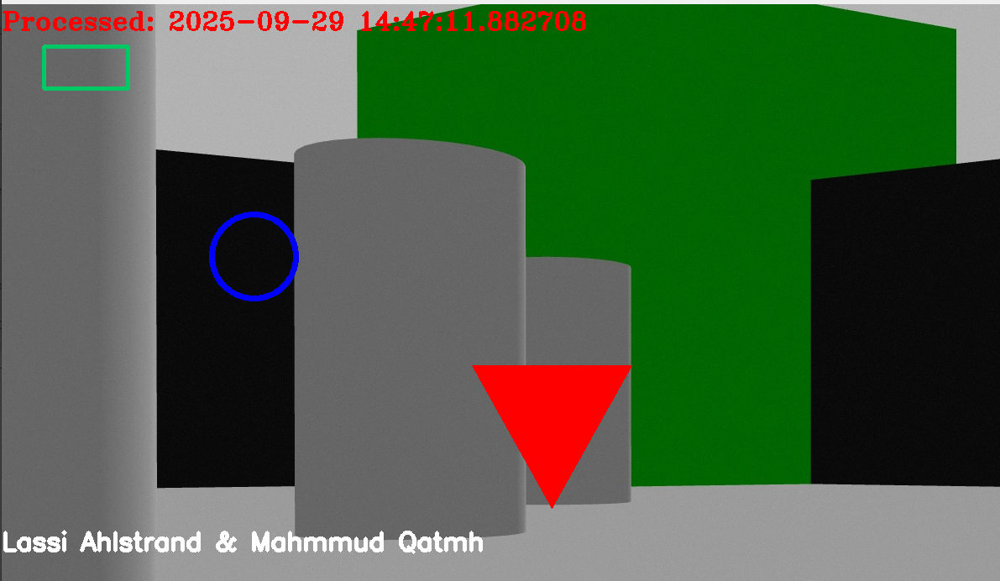
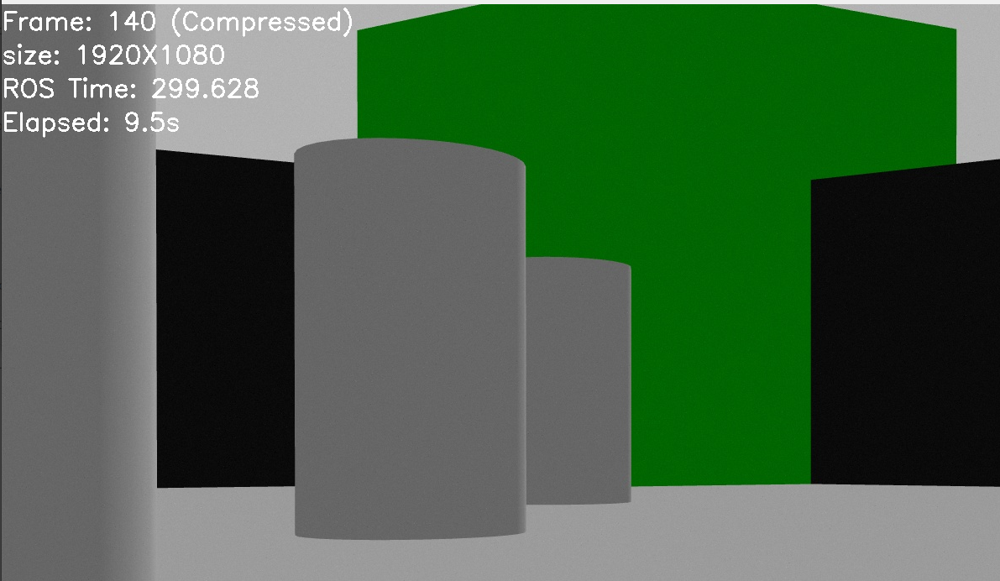
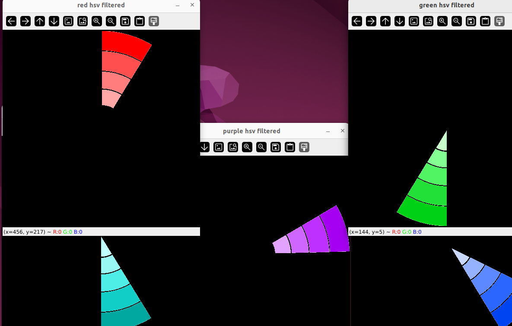
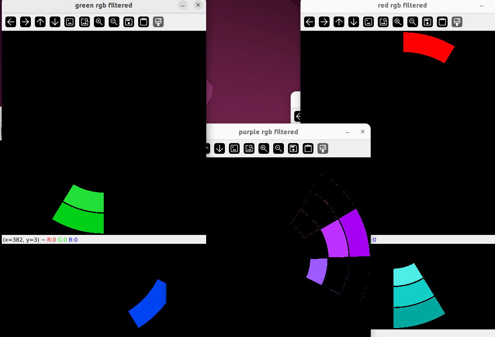
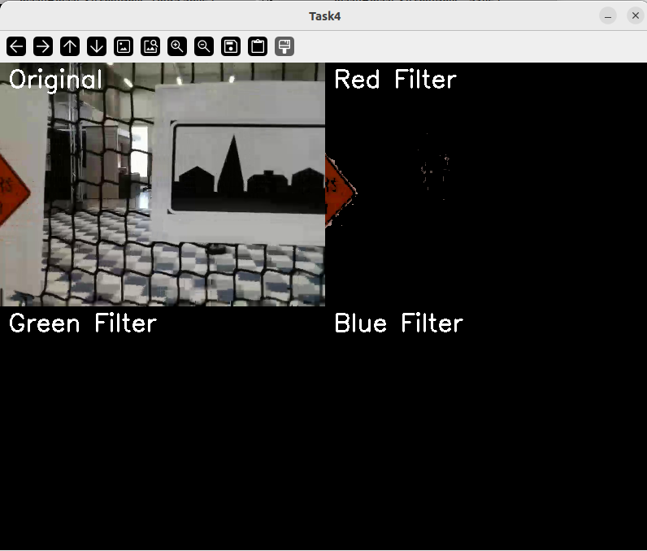
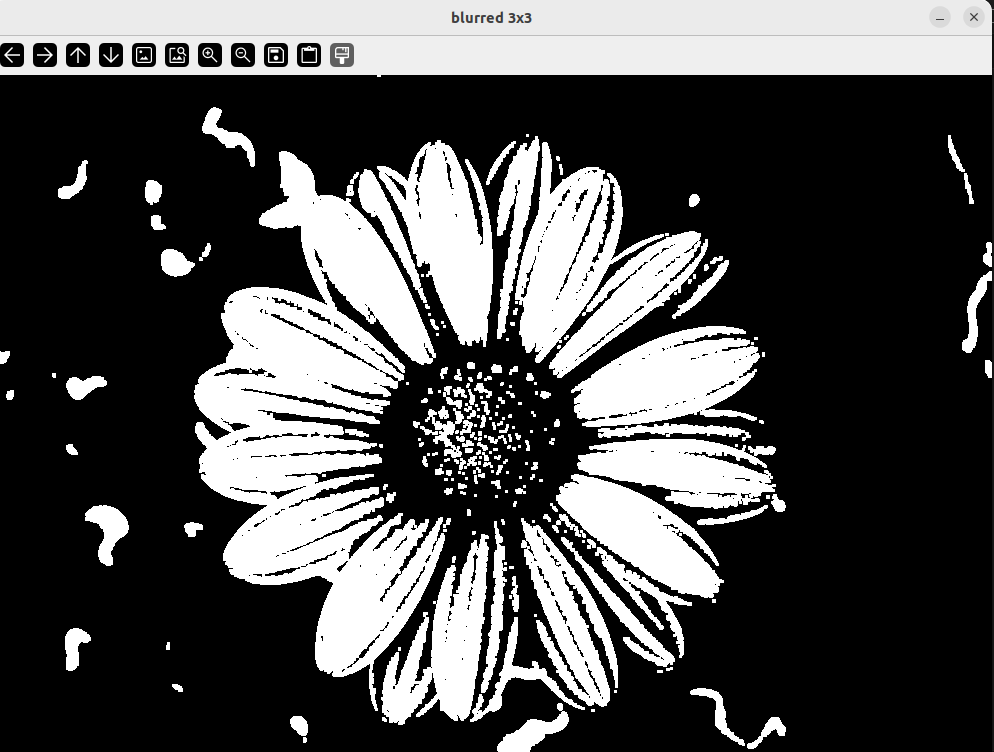
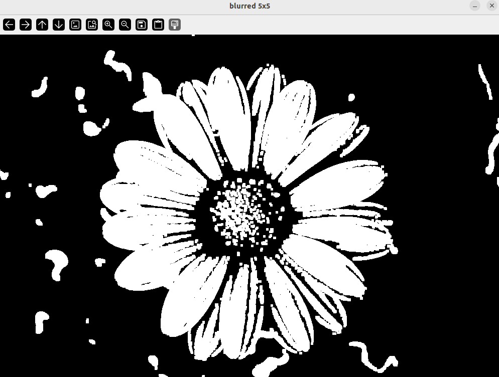
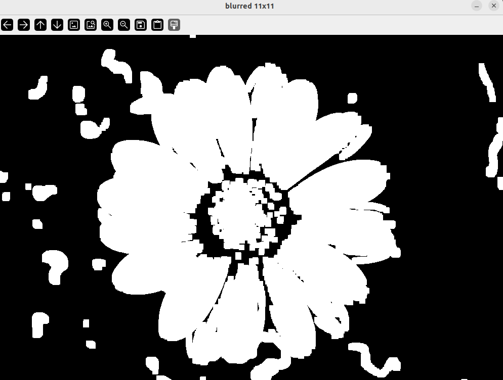
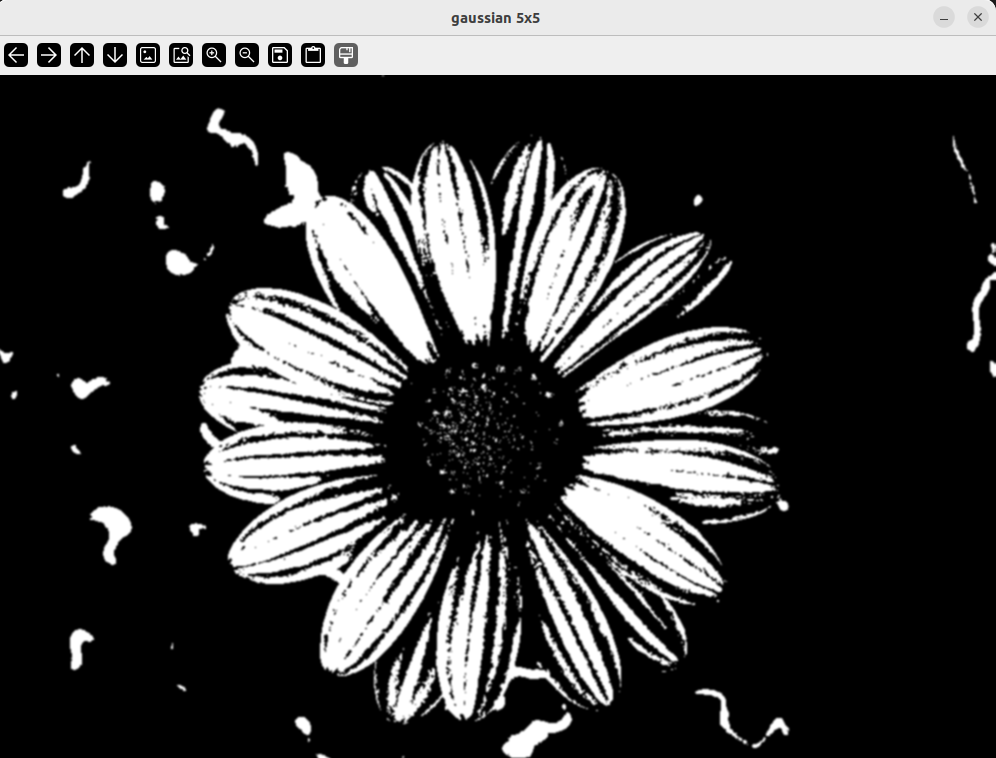
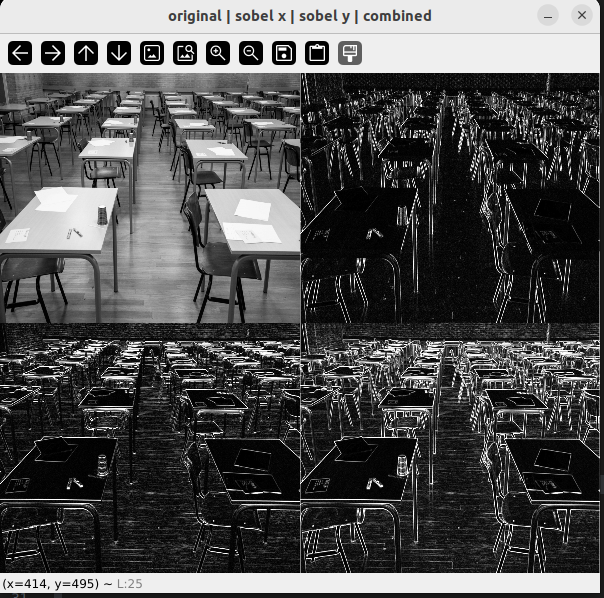

# task1
We read drone_image.jpg using opencv and then draw different shapes to that image. rectangle and circle was made using ready functions that opecv has.Filled triangle was made using cv2.fillpoly() by giving it corner points of the triangle. To show current date and time datetime library was used.

## to run
> python3 task1.py

# task2
We subscribe ros2 topic camere/image/compressed from lab2_rosbags. Image is converted to opencv format using cv_bridge using compressed_imgmsg_to_cv2(). rosbag video is shown using cv2.imshow() and text is added to the video using cv2.putText() Frame tells how many frames have been received. size tell width and height of frame, ros time get time from message header and elapsed time shows how long node has been running.

## to run
> python3 task2.py

> ros2 bag play rosbags/lab2_rosbag/

# task3
The image wheel.png is loaded and converted to both RGB and HSV color spaces. Using manual threshold values filters are applied to detect red, green, blue, purple and cyan in both RGB and HSV. Color masks are created using cv2.inRange() and applied with cv2.bitwise_and() to show the filtered areas.Visually, HSV filtering is easier to control and gives more accurate results. In real-life applications HSV is more useful because it is less sensitive to lighting and brightness changes.

## to run
> python3 task3.py

# task4
In this task we subscribe ros2 camera topic image_raw from the rosbag lab3_2 and process the data. Image is converted to opencv format using cv bridge and resized to 400x300. Image is conveeted to HSV for better color filtering. HSV filter was used instead of RGB because it allows more accurate color detection

## to run
> python3 task4.py
> ros2 bag play rosbags/lab3_2

# task5

The image (flower.png) is read and convolution function is used to apply blur to it. Then we create box blur kernel using function box_blur() which fills kernel with values summing to 1. The convolution is implemented from scratch by sliding the kernel over the image and calculating the sum of elements multiplications. The we test it to different kernel sizes (3x3, 5x5, 11x11) to see how size affects the blur. When kernel is increases blur becomes stronger because more pixels are averaged. Gaissuan blur is then applied to 5x5 kernel and it gives photo maybe little softer blur than box blur.

## to run
> python3 task5.py

# task6

The input image (classroom.png) is read and converted to grayscale for processing. Two 3x3 sobel kernels are made that are  sobel_x for vertical edges and sobel_y for horizontal edges. We used same convolution function that was made in the previous task using zero padding. Results of sobel_x and sobel_y is combined using g = sqrt(gx^2 + gy^2). The images are converted to uint8 (range 0–255) using astype(np.uint8) so they can be displayed correctly with opencv. Result is Sobel X, Sobel Y, and combined gradient images are shown in a 2×2 grid. 

## to run
> python3 task6.py

