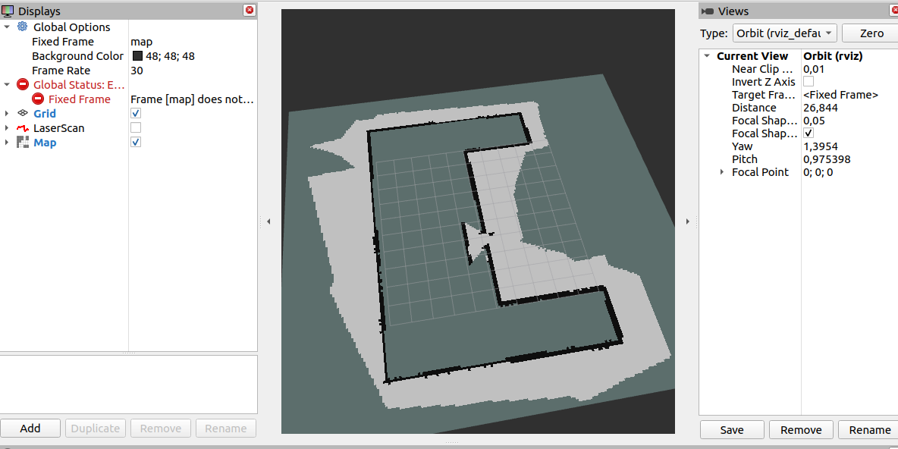
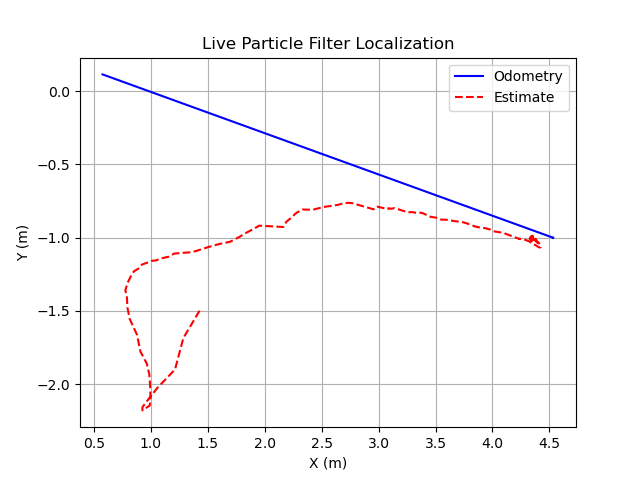

# Task 3

Built 20m x 20m grid with 10cm cells. The grid mapping system was implemented using odometry and lidar data and the map was published to rviz. Robot was driven in turtlebot3_house.launch.py. Black area is obstacles in this case walls of the house, white is explored free space and gray is area that has not been explored. Robot bresenham's line algorithm to trace rays from lidar.

to run this code use: 

**ros2 run task3 lidar_mapper**

**ros2 launch turtlebot3_gazebo turtlebot3_house.launch.py**

# Task 4

In this task we made particle filter localization algorithm for turtlebot. Position of robot was estimated using particle filter. It got inputs from odometry data (odom) and lidar scan(scan). Position of the know feature  at cordinates (2, -2) was predicted for each particle and compared with lidar measurement. 
for visualization matplotlibs live plot feature was used to show odometry path versus estimated trajectory in real time.

