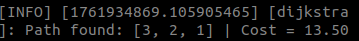
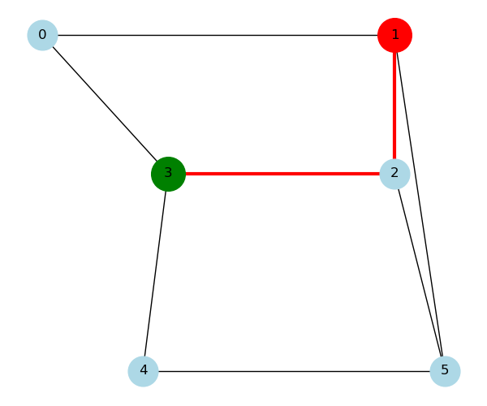

## Task 1
In this task we made launch file to load custom world and spawn robot to it. We made also lidar mapper and waypoint navigation system with predefined trajectories. We record the robot's actual trajectory and plot it. 

**lidar_mapping.py**
- subscribes to `/scan` and `/odom` 
- creates occypancy grid from lidar.
- Saves map to    
`mymap.csv` every 2 seconds

**waypoint_navigator.py**
- subscribes `/odom`
- publishes `/cmd_vel`
- navigate using predefined waypoints and plots result

### run
**terminal 1**

`ros2 launch group18_navigation_stack task.launch.py x_pose:=-8 y_pose:=4.5`

**terminal 2**
`ros2 run group18_navigation_stack lidar_mapper`

**terminal 3**
`ros2 run group18_navigation_stack waypoint_navigator`

## Task 2

In this task we implemented dijkstra algorithm for planning path between two nodes. Environment was given as a graph where nodes were waypoint and edges connections. dijkstra finds shortest path between start and goal and moves robot though them

**dijkstra_planning.py**
- builds graph with waypoints and distances as edge weights
- uses priorityqueue in dijkstra algorithm

### run

**terminal 1**

`ros2 launch group18_navigation_stack task.launch.py`

**terminal 2**

`ros2 run group18_navigation_stack dijkstra`

there is robot starting from 0 and going to 5

here is robot going from 3 to1

## Task 3

in this task we made path finding algorithm using A*. It uses heuristic (euclidean distance to goal) to guide the search. Path was exactly same as in task2

**a_star_task3.py**
- uses same graph with dijkstra
- finds optimal path with fewer expansions
- publishes and plots result

### run

**terminal 1**

`ros2 launch group18_navigation_stack task.launch.py`

**terminal 2**

`ros2 run group18_navigation_stack astar`

from 0 to 5 using A*

from 3 to 1 using A*

comparing A* to dijkstra the paths are looking the same but the cost is little bit less in A*

## Task 4

This task extended dijkstra algorithm to go through all the nodes in the map automatically. The robot finds nearest node that has not been visited yet and travels there and repeats until all nodes are visited.

### run

`ros2 launch group18_navigation_stack task.launch.py`

`ros2 run group18_navigation_stack dijkstra_full`

going through all the nodes using dijkstra algorithm starting from (0, 0)

