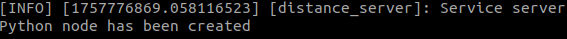
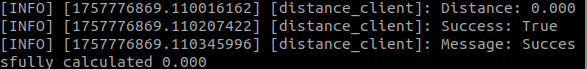
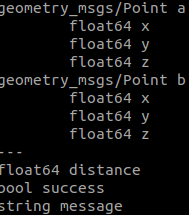
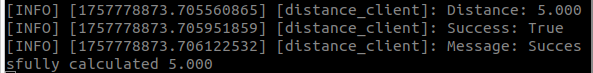
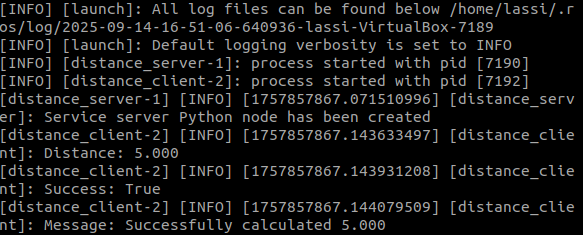

# Task 3

## Build the Package

```bash
colcon build
source install/setup.bash
```

---

## Run the Server

```bash
ros2 run distance_service distance_server
```



---

## Run the Client

```bash
ros2 run distance_service distance_client
```



---

## View the Service Interface

```bash
ros2 interface show custom_interface/srv/Distance
```



---

# Task 4

In this task, we modified the service from Task 3 and created a YAML file to provide parameters.

### YAML File

[params.yaml](distance_service/config/params.yaml)

---

### Launching the Client with Parameters

```bash
ros2 run distance_service distance_client --ros-args --params-file src/distance_service/config/params.yaml
```



---

# Task 6 

In this task, we created a launch file to run both the server and client using the YAML parameters.

## Command to Launch

```bash
ros2 launch distance_bringup params.launch.py
```


